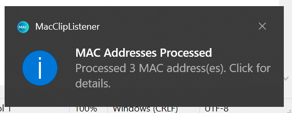

# MAC-Clipboard-Listener

A very simple C# application to automatically re-format copied MAC addresses, perform vendor/OUI lookups and display switchport/link details integrating the [Netdisco API](https://netdisco.org/).

## Features

<b>MAC address re-formatting</b>

Convert between MAC address formats automatically.

<b>OUI lookup and Netdisco support</b>

Support for connection to a Netdisco server to identify connected network device information from copied MAC addresses.

