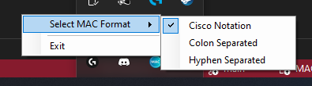
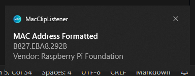

# MAC-Clipboard-Listener

A very simple C# application to automatically re-format copied MAC addresses, perform vendor/OUI lookups and display switchport/link details integrating the [Netdisco API](https://netdisco.org/).

## TODO

- Implement Netdisco MAC lookup API into details form
- Implement Netdisco key regeneration on error: not authorized
  - Update README / Docs

